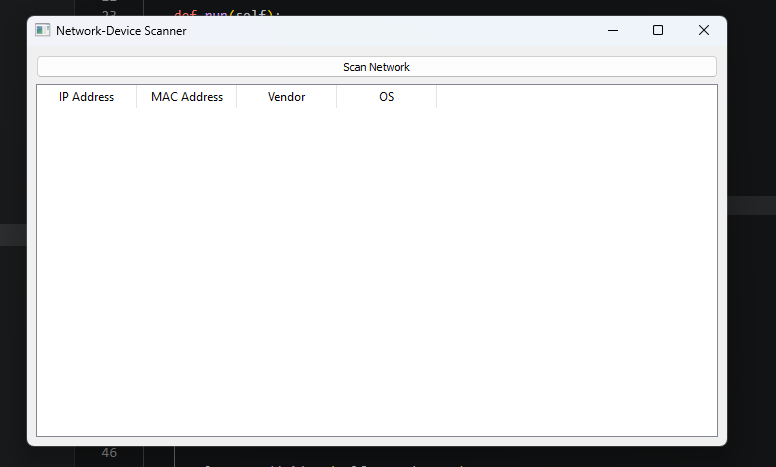
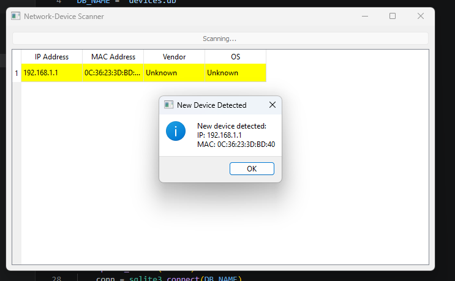
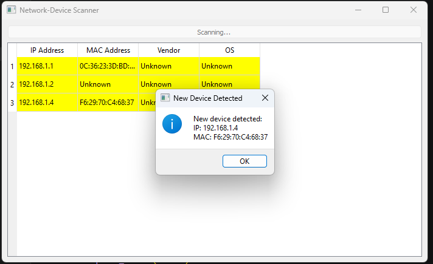
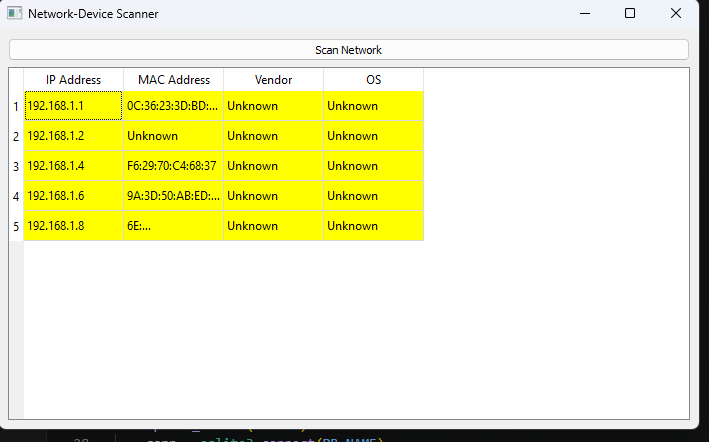
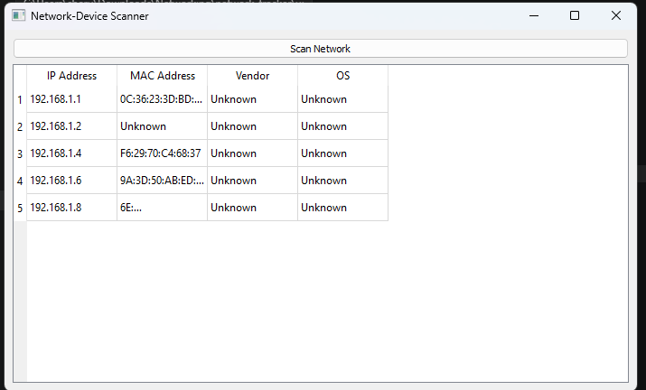

# Network Device Scanner

A Python-based desktop application for discovering and monitoring devices connected to a local Wi-Fi/LAN network. The application scans active hosts, stores device information in a SQLite database, highlights newly detected devices, and provides a simple graphical interface using PyQt5.

## Features

- Scan devices connected to a local network
- Discover IP address, MAC address, and vendor information
- Store discovered devices in SQLite
- Highlight newly connected devices
- Automatic periodic network scanning
- Event logging
- User-friendly PyQt5 GUI

## Technologies Used

- Python
- PyQt5
- SQLite
- python-nmap

## Screenshots

### Main Interface

Displays the application before a network scan is initiated.



### Network Scan in Progress

The application performs host discovery while keeping the interface responsive.



### Newly Detected Devices

Newly discovered devices are highlighted and a notification is displayed.



### Device Detection Notification

Each newly detected device generates an alert containing its IP and MAC address.



### Re-scan

Previously discovered devices are retrieved from the database without being highlighted as new.



## Project Structure

```text
Network-Device-Scanner/
│── main.py
│── scanner.py
│── database.py
│── event.py
│── requirements.txt
│── README.md
│── screenshots/
```

## Installation

```bash
pip install -r requirements.txt
```

## Run

```bash
python main.py
```

## Design Decision

To improve scan performance, operating system detection was intentionally omitted. The scanner prioritizes rapid host discovery using IP addresses, MAC addresses, and vendor information, making periodic monitoring faster and more responsive.

## Limitations

- Designed for local Wi-Fi/LAN environments.
- Discovery depends on network configuration and device visibility.
- Enterprise firewalls, VLANs, or access controls may restrict host discovery.

## Future Enhancements

- Optional operating system detection for detailed device information
- Port scanning
- Device trust management
- Export reports (CSV/PDF)
- Real-time notifications
- Search and filtering
- Optional automatic periodic scanning to minimize unnecessary database growth

## Copyright

© 2026 Hanvith Varma. All rights reserved.

This repository is intended for portfolio and evaluation purposes only. Unauthorized copying, modification, or redistribution of the source code is prohibited.
